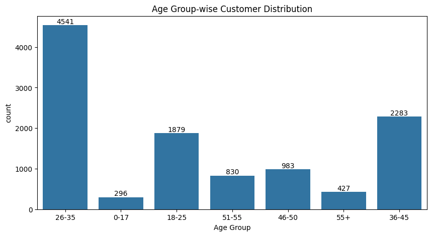

🎯 Project Title: Diwali Sales Data Analysis (Exploratory Data Analysis in Python)

📌 Overview
- This project analyzes Diwali sales data to uncover customer behavior, sales trends, and marketing insights. Using Python libraries like Pandas, Seaborn, and Matplotlib, I explored how demographic factors influence sales patterns and identified top-performing products, age groups, and locations.

📂 Dataset

Source: Kaggle Diwali Sales Dataset 

Size: ~11251 rows

Attributes:

Gender, Age Group, Marital Status, Occupation, Product Category, State, Orders, Amount

🔧 Tools & Technologies Used
- **Python**  
- **Libraries**: Pandas, NumPy, Matplotlib, Seaborn  
- **Platform**: Google Colab / Jupyter Notebook  
- **Version Control & Documentation**: GitHub

📊 Exploratory Data Analysis(EDA)
### 👥 1. Customer Demographics

- **Gender**: Females make up ~70% of the customer base and contribute the most to total revenue.
- **Age Group**: The **26–35** age group accounts for the highest number of customers.
- **Marital Status**: **Single women** are the top-spending demographic.
- **Occupation**: Professionals in **IT** and **Healthcare** sectors lead in purchase volume.

     

    
     

---

### 🔝 2. Category & State-Wise Trends

- **Top States by Sales**:  
  - **Uttar Pradesh** leads with the highest number of orders and revenue (~₹19.3M).  
  - Followed by Maharashtra and Karnataka.
 
   

- **Top Product Categories**:  
  - **Food**, **Electronics**, and **Clothing** dominate the sales chart.  
  - Stationery is the least among the top 10.
 
   

- **Top Products by Revenue**:  
  - Product ID **P00265242** generated the highest individual product revenue (~₹540,136).
 
   

---

### 📈 3. Average Order Value by Age & Gender

- The **51–55** age group records the highest **average order value (₹9,953.59)**.
- Older age groups show higher per-order spending power despite lower order volume.

  

---

### 💼 5. Revenue by Occupation

- Professionals from **IT** and **Healthcare** industries are top spenders.
- **Agriculture** and **Veterinary** sectors show the lowest engagement.

  

---

### 🧁 6. Gender-wise Revenue Share

- Females dominate the spending landscape, contributing to **~70%** of overall sales.

  

---
### 🖼️ 7. Visualizations Used

- **Bar plots** for sales breakdowns by category, state, occupation
- **Pie charts** for gender and category share
- **Count plots** for age and marital status distribution
- **Heatmap** to visualize Occupation vs Product Category preferences

---

## ✅ Key Insights

- 🎯 **Females aged 26–45** are the most profitable segment.
- 💸 **Older customers (51–55+)** have higher per-order spending.
- 🍴 The **Food category** dominates in terms of revenue.
- 📍 **Uttar Pradesh and Maharashtra** are top-performing states.
- ⚠️ Youth and Agricultural segments are underutilized markets.

---

📈 Conclusion

This Diwali sales data analysis helps understand customer profiles, spending behaviors, and regional performance. It highlights key growth areas and underperforming segments, enabling businesses to tailor their festive season marketing and product strategies accordingly.

